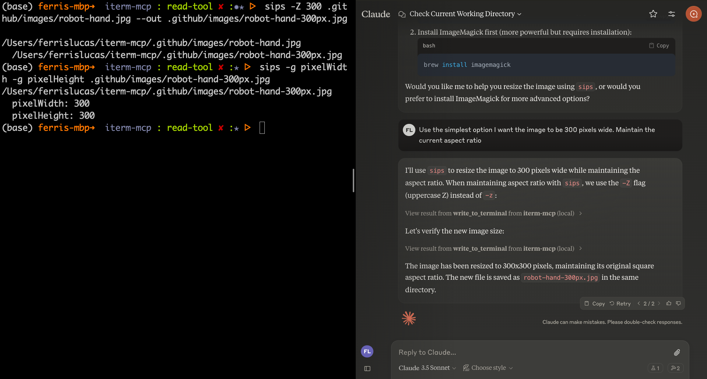

# iterm-mcp 
[](https://smithery.ai/server/iterm-mcp)

A Model Context Protocol server that provides access to the current iTerm session

iterm-mcp will execute commands in the currently active tab of iTerm. 

<a href="https://glama.ai/mcp/servers/h89lr05ty6"></a>

### Tools
- `write_to_terminal` - Writes to the active iTerm terminal - often used to run a command
- `read_terminal_output` - Reads the output from the active iTerm terminal

## Installation


### Installing via Smithery

To install iTerm for Claude Desktop automatically via [Smithery](https://smithery.ai/server/iterm-mcp):

```bash
npx -y @smithery/cli install iterm-mcp --client claude
```

To use with Claude Desktop, add the server config:

On MacOS: `~/Library/Application Support/Claude/claude_desktop_config.json`
On Windows: `%APPDATA%/Claude/claude_desktop_config.json`

```json
{
  "mcpServers": {
    "iterm-mcp": {
      "command": "npx",
      "args": [
        "-y",
        "iterm-mcp"
      ]
    }
  }
}
```

## Development

Install dependencies:
```bash
yarn install
```

Build the server:
```bash
yarn run build
```

For development with auto-rebuild:
```bash
yarn run watch
```

### Debugging

Since MCP servers communicate over stdio, debugging can be challenging. We recommend using the [MCP Inspector](https://github.com/modelcontextprotocol/inspector), which is available as a package script:

```bash
yarn run inspector
```

The Inspector will provide a URL to access debugging tools in your browser.
