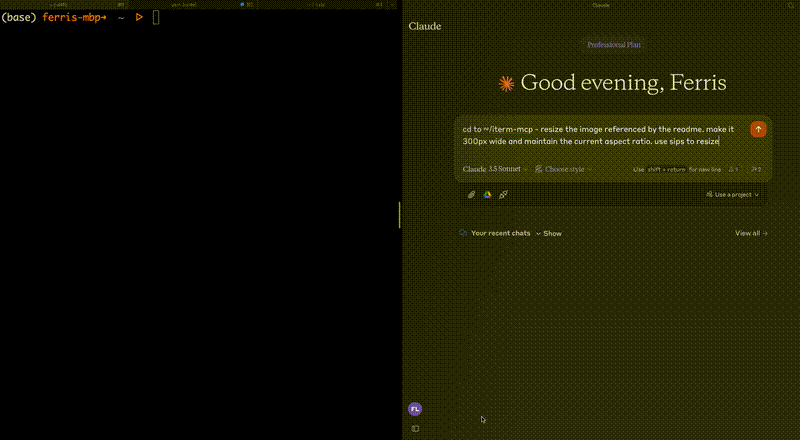

# iterm-mcp 
A Model Context Protocol server that provides access to your iTerm session.



### Features

**Efficient Token Use:** iterm-mcp gives the model the ability to inspect only the output that the model is interested in. The model typically only wants to see the last few lines of output even for long running commands. 

**Natural Integration:** You share iTerm with the model. You can ask questions about what's on the screen, or delegate a task to the model and watch as it performs each step.

**Full Terminal Control and REPL support:** The model can start and interact with REPL's as well as send control characters like ctrl-c, ctrl-z, etc.

**Multiple Transport Options:** Choose between stdio (default) or Server-Sent Events (SSE) transport to connect to the server. SSE allows web-based clients to connect to iterm-mcp.

**Easy on the Dependencies:** iterm-mcp is built with minimal dependencies and is runnable via npx. It's designed to be easy to add to Claude Desktop and other MCP clients. It should just work.


## Safety Considerations

* The user is responsible for using the tool safely.
* No built-in restrictions: iterm-mcp makes no attempt to evaluate the safety of commands that are executed.
* Models can behave in unexpected ways. The user is expected to monitor activity and abort when appropriate.
* For multi-step tasks, you may need to interrupt the model if it goes off track. Start with smaller, focused tasks until you're familiar with how the model behaves. 

### Tools
- `write_to_terminal` - Writes to the active iTerm terminal, often used to run a command. Returns the number of lines of output produced by the command.
- `read_terminal_output` - Reads the requested number of lines from the active iTerm terminal.
- `send_control_character` - Sends a control character to the active iTerm terminal.

### Requirements

* iTerm2 must be running
* Node version 18 or greater


## Installation

### Using with Claude Desktop

To use with Claude Desktop, add the server config:

On macOS: `~/Library/Application Support/Claude/claude_desktop_config.json`
On Windows: `%APPDATA%/Claude/claude_desktop_config.json`

#### Using stdio transport (default):
```json
{
  "mcpServers": {
    "iterm-mcp": {
      "command": "npx",
      "args": [
        "-y",
        "iterm-mcp"
      ]
    }
  }
}
```

#### Using SSE transport:
```json
{
  "mcpServers": {
    "iterm-mcp": {
      "command": "npx",
      "args": [
        "-y",
        "iterm-mcp",
        "--transport",
        "sse",
        "--port",
        "3000",
        "--host",
        "localhost"
      ]
    }
  }
}
```

### Installing via Smithery

To install iTerm for Claude Desktop automatically via [Smithery](https://smithery.ai/server/iterm-mcp):

```bash
npx -y @smithery/cli install iterm-mcp --client claude
```
[](https://smithery.ai/server/iterm-mcp)

## Command Line Options

iterm-mcp supports the following command-line options:

- `--transport, -t <type>`: Transport type (stdio or sse). Default: stdio
- `--port, -p <number>`: Port for SSE server (when using SSE transport). Default: 3000
- `--host, -h <string>`: Host for SSE server (when using SSE transport). Default: localhost
- `--base-path, -b <path>`: Base path for SSE server endpoints. Default: /mcp

For example, to start iterm-mcp with SSE transport on port 3030:

```bash
iterm-mcp --transport sse --port 3030
```

## Environment Configuration

iterm-mcp now supports configuration through environment variables and a `.env` file. This is especially useful for development or when running in different environments.

Create a `.env` file in the project root with the following structure:

```
# iterm-mcp configuration
# Transport type: "stdio" or "sse"
ITERM_MCP_TRANSPORT=sse

# SSE server configuration (used when transport is "sse")
ITERM_MCP_PORT=3000
ITERM_MCP_HOST=localhost
ITERM_MCP_BASE_PATH=/mcp
```

Supported environment variables:

- `ITERM_MCP_TRANSPORT`: Transport type ("stdio" or "sse")
- `ITERM_MCP_PORT`: Port for SSE server
- `ITERM_MCP_HOST`: Host for SSE server
- `ITERM_MCP_BASE_PATH`: Base path for SSE server endpoints

Environment variables take precedence over command-line arguments.

## Using with Web Clients

When running with SSE transport, iterm-mcp provides the following endpoints:

- `http://[host]:[port][basePath]/sse`: Endpoint for SSE connections
- `http://[host]:[port][basePath]/messages`: Endpoint for sending messages to the server

See the test file at `test/transport/SseTransport.test.ts` for an example HTML client implementation.

## Development

Install dependencies:
```bash
yarn install
```

Build the server:
```bash
yarn run build
```

For development with auto-rebuild:
```bash
yarn run watch
```

### Debugging

Since MCP servers communicate over stdio, debugging can be challenging. We recommend using the [MCP Inspector](https://github.com/modelcontextprotocol/inspector), which is available as a package script:

```bash
yarn run inspector
yarn debug <command>
```

The Inspector will provide a URL to access debugging tools in your browser.

### Testing SSE Transport

To test the SSE transport, run:

```bash
ts-node --esm test/transport/SseTransport.test.ts
```

This will start an SSE server on port 3030 and provide instructions for testing with a browser client.
